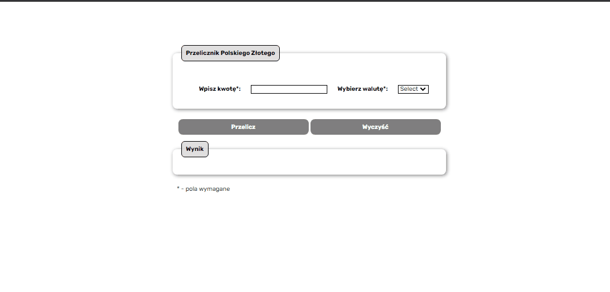

# Currency-Converter

#### First steps in coding and programming

## DEMO

https://jerszynski.github.io/Currency-Converter/

---

#### Languages used in project:

 

  

---

- Welcome to my second website where you can test my Currency-Converter. It's my another project where I'm testing my skill with HTML, CSS and JS.  
  Hope you will like it :)
   
   

- Below is quick look on website: 

